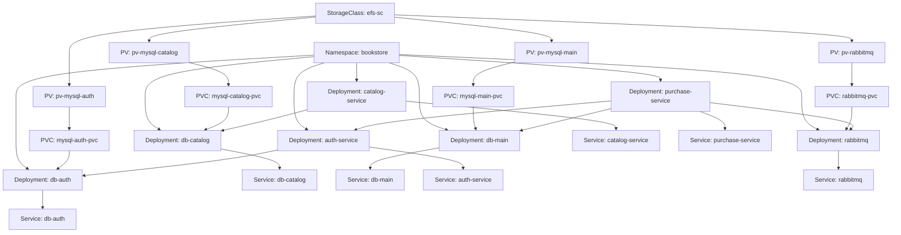

# 📘 Proyecto P2_Bookstore  
**Materia:** ST0263-252 – *Tópicos Especiales en Telemática*  
**Profesor:** Álvaro Enrique Ospina Sanjuán  
**Autores:**  
- Daniel Alberto Posada Murillo — *dposad21@eafit.edu.co*  
- John Jairo Montoya Moreno — *jmonto98@eafit.edu.co*  
- Orleis Quiceno Velásquez — *oquicen2@eafit.edu.co*  

---

## 1. Descripción general

**P2_Bookstore** es una aplicación web desarrollada como parte del curso **Sistemas Distribuidos (ST0263-252)** cuyo propósito es **demostrar la implementación de una arquitectura basada en microservicios desplegada en contenedores Docker y orquestada en Kubernetes (EKS de AWS)**.

La aplicación representa una **Bookstore (tienda de libros)** con tres servicios principales:

- **auth_service:** gestiona la autenticación y autorización de usuarios.  
- **catalog_service:** administra el catálogo de libros (altas, bajas, modificaciones y consultas).  
- **purchase_service:** maneja el flujo de compra y registro de transacciones.

El objetivo principal es **mostrar competencias prácticas en desarrollo distribuido, despliegue con Docker/Kubernetes, y uso de servicios en la nube AWS (EKS, EFS, LoadBalancer, Helm, kubectl)**.

---

## 1.1. Cumplimiento de los objetivos

- Implementación completa de arquitectura **basada en microservicios**.  
- Contenerización de los servicios con **Docker**.  
- Despliegue orquestado mediante **Kubernetes (manifiestos YAML)**.  
- Integración de **balanceo de carga (LoadBalancer)** y **almacenamiento persistente con EFS**.  
- Ejecución y prueba en **entorno local y en AWS EKS**.  
- Documentación reproducible para cualquier usuario o evaluador.

---

## 1.2. Aspectos no implementados o pendientes

- No se desarrolló aún una **interfaz gráfica avanzada (frontend web)**, los servicios son consumidos vía API REST.  
- Falta de **módulo de monitoreo** (Prometheus, Grafana) y pipeline CI/CD automatizado.  
- Persistencia de datos limitada a contenedores en ejecución (sin RDS o DynamoDB externos).  

---

## 2. Arquitectura y diseño de alto nivel

### 2.1. Arquitectura general

La aplicación sigue el patrón **microservicios**, donde cada módulo opera de manera independiente y se comunica mediante **REST API** internas dentro del clúster de Kubernetes.

```
        ┌──────────────────┐
        │  auth_service    │
        │  Flask / JWT     │
        └───────┬──────────┘
                │
                ▼
        ┌──────────────────┐
        │ catalog_service  │
        │ Flask / SQLite   │
        └───────┬──────────┘
                │
                ▼
        ┌──────────────────┐
        │ purchase_service │
        │ Flask / Requests │
        └──────────────────┘
```

Cada microservicio posee:
- Archivo `Dockerfile`.  
- Archivos `deployment.yaml` y `service.yaml` en la carpeta `/k8s`.  
- Comunicación interna mediante nombres DNS del servicio (`auth-service`, `catalog-service`, etc.).  

### 2.2. Buenas prácticas aplicadas
- Uso de **Blueprints** en Flask para modularidad.  
- Variables de entorno definidas en los manifiestos Kubernetes.  
- Despliegue reproducible mediante `kubectl apply -f`.  
- Balanceo de carga automático con `Service: type LoadBalancer`.  
- Escalabilidad con `kubectl scale`.

---

## 3. Ambiente de desarrollo

### 3.1. Tecnologías utilizadas

| Componente | Tecnología | Versión aproximada |
|-------------|-------------|--------------------|
| Lenguaje principal | Python | 3.9+ |
| Framework web | Flask | 2.x |
| Contenerización | Docker | 24.x |
| Orquestación | Kubernetes | 1.29+ |
| Almacenamiento persistente | AWS EFS | - |
| Balanceador | AWS ELB (LoadBalancer) | - |
| Gestor de paquetes | pip / requirements.txt | - |

### 3.2. Estructura de carpetas

```
Bookstore/
├── auth_service
│   └── models
├── catalog_service
│   └── models
├── k8s
│   ├── auth
│   ├── catalog
│   ├── databases
│   ├── purchase
│   ├── pv
│   └── rabbitmq
└── purchase_service
    └── models
```

### 3.3. Ejecución local

#### 1️ Clonar el repositorio
```bash
git clone https://github.com/jmonto98/p2_bookstore.git
cd p2_bookstore
```

#### 2️ Construir imágenes Docker
```bash
docker build -t auth_service ./auth_service
docker build -t catalog_service ./catalog_service
docker build -t purchase_service ./purchase_service
```

#### 3️ Levantar los contenedores
```bash
docker-compose up -d --build
```

#### 4️ Acceso
- Auth: `http://localhost:5000`
- Catalog: `http://localhost:5001`
- Purchase: `http://localhost:5002`

---

##  4. Despliegue en AWS EKS (Kubernetes)

### 4.1. Arquitectura del cluster Bookstore (EKS + Kubernetes)



### 4.2. Configuración inicial de EKS

```bash
aws eks update-kubeconfig --region us-east-1 --name MyEks
kubectl get nodes
```

### 4.3. Configurar almacenamiento EFS

1. Crear un servicio **EFS (Elastic File System)** en AWS.  
2. Permitir puertos **NFS, HTTP, HTTPS, MySQL, SSH** en el *Security Group*.  
3. Instalar el driver CSI de EFS:
   ```bash
   helm repo update
   helm install aws-efs-csi-driver aws-efs-csi-driver/aws-efs-csi-driver        --namespace kube-system        --set controller.serviceAccount.create=false        --set controller.serviceAccount.name=efs-csi-controller-sa
   kubectl get pods -n kube-system | grep efs
   ```
4. Editar el ID de EFS en los archivos YAML de `PersistentVolume` y `PersistentVolumeClaim`.

---

### 4.4. Desplegar los microservicios

```bash
kubectl apply -f k8s/auth/
kubectl apply -f k8s/catalog/
kubectl apply -f k8s/purchase/
```

### 4.5. Verificar el estado
```bash
kubectl get pods --watch
kubectl get all -o wide
```

### 4.6. Escalamiento y LoadBalancer

```bash
kubectl scale deployment catalog-service --replicas=2
kubectl get svc
```

El balanceador de AWS (ELB) distribuirá el tráfico entre los pods.  
Puedes obtener la IP pública con:
```bash
kubectl get svc purchase-service
```

---

##  5. Guía rápida de uso

1. **Registrar usuario:** `POST /register` en `auth_service`.  
2. **Autenticarse:** `POST /login` → devuelve token JWT.  
3. **Consultar libros:** `GET /books` en `catalog_service`.  
4. **Realizar compra:** `POST /purchase` enviando el token.  

Ejemplo:
```bash
curl -X POST http://<LOAD_BALANCER_IP>/purchase   -H "Authorization: Bearer <token>"   -d '{"book_id": 3, "quantity": 2}'
```

---

##  6. Referencias

- Guía de laboratorio **AWS EKS-est.pdf**  
- Repositorio base: [https://github.com/st0263eafit/st0263-252](https://github.com/st0263eafit/st0263-252)  
- Flask Official Docs: [https://flask.palletsprojects.com](https://flask.palletsprojects.com)  
- AWS EKS + Helm + EFS deployment guide.  